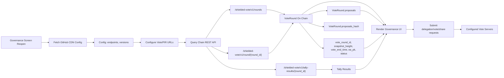

# token-holder-voting-config

Service discovery for shielded voting infrastructure. Published via GitHub
Pages so wallets can find vote servers and PIR endpoints without running their
own chain node.

The schema targets [ZIP 1244 §Vote Configuration Format](https://github.com/zcash/zips/pull/1244).

## Schema

```json
{
  "config_version": 1,
  "vote_servers": [
    { "url": "https://...", "label": "primary" }
  ],
  "pir_endpoints": [
    { "url": "https://...", "label": "PIR primary" }
  ],
  "supported_versions": {
    "pir": ["v0"],
    "vote_protocol": "v0",
    "tally": "v0",
    "vote_server": "v1"
  }
}
```

| Field | Type | Notes |
| --- | --- | --- |
| `config_version` | int | Schema version. Currently `1`. |
| `vote_servers[]` | `{url, label}` | Chain REST + helper endpoints. Wallets use the first for API traffic; all are used for share submission. |
| `pir_endpoints[]` | `{url, label}` | Nullifier PIR endpoints. Wallets use the first. |
| `supported_versions.pir` | `[string]` | Wallet must support ≥1 listed PIR version. |
| `supported_versions.{vote_protocol, tally, vote_server}` | string | Wallet must recognize each version. |

Round identity, snapshot height, deadline, title, description, and proposals
are **not** part of this config — they live on the chain and wallets read them
from the round object directly.

## Proposals come from the chain

The chain stores the authoritative round id on `VoteRound.vote_round_id`, the
authoritative snapshot/deadline metadata on `VoteRound.snapshot_height` and
`VoteRound.vote_end_time`, and the authoritative proposal list on
`VoteRound.proposals`, committed via `VoteRound.proposals_hash`. Wallets fetch
round identity, proposal titles, descriptions, and options from chain REST
endpoints such as `/shielded-vote/v1/rounds`,
`/shielded-vote/v1/rounds/active`, and
`/shielded-vote/v1/round/{round_id}`.

This config tells wallets which service endpoints and protocol versions to use.
Updating round metadata, proposal text, or activating a new round means creating
or updating the on-chain voting round, not editing `voting-config.json`.

## Recommended Sequence Flow



## CDN

Served via GitHub Pages at:

`https://valargroup.github.io/token-holder-voting-config/voting-config.json`

Deployments happen automatically on push to `main`.

## Adding a server

Operators join the chain using `join.sh` from [vote-sdk](https://github.com/valargroup/vote-sdk)
(`join-loop` waits for funding and runs `create-val-tx`). That flow does **not** add
your REST URL here automatically.

1. After you are bonded, fork this repo (or push a branch if you have access)
2. Add your server entry to `vote_servers` in `voting-config.json` (URL + label)
3. Open a pull request
4. A maintainer reviews and merges — your server is live within ~30 seconds

## Removing a server

Same process: open a PR removing the entry.
